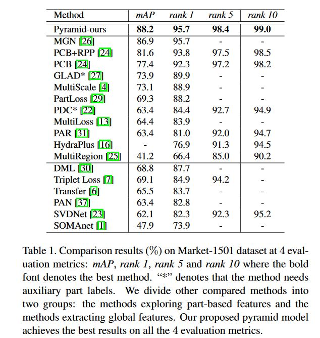
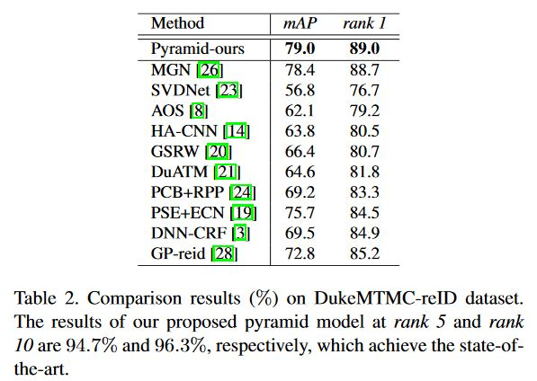
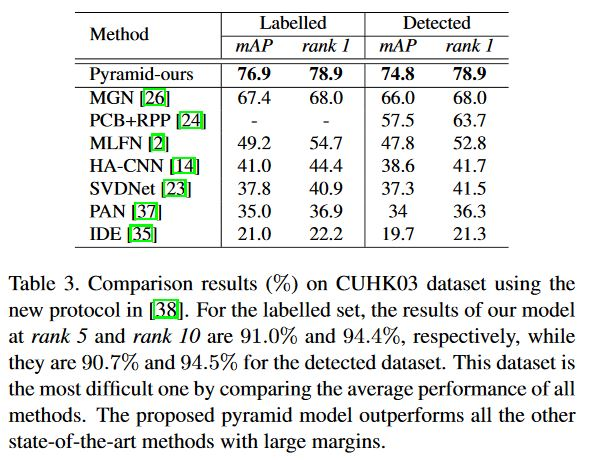

# Pyramidal Person Re-IDentification via Multi-Loss Dynamic Training (CVPR 2019)

Code for CVPR 2019 paper [Pyramidal Person Re-IDentification via Multi-Loss Dynamic Training](http://openaccess.thecvf.com/content_CVPR_2019/papers/Zheng_Pyramidal_Person_Re-IDentification_via_Multi-Loss_Dynamic_Training_CVPR_2019_paper.pdf). 

## Introduction
Most existing Re-IDentification (Re-ID) methods are highly dependent on precise bounding boxes that enable images to be aligned with each other. However, due to the challenging practical scenarios, current detection model soften produce inaccurate bounding boxes, which inevitably degenerate the performance of existing Re-ID algorithms. We propose a novel coarse-to-fine pyramid model to relax the need of bounding boxes, which not only incorporates local and global information, but also integrates the gradual cues between them. The pyramid modelis able to match at different scales and then search for the correct image of the same identity, even when the image pairs are not aligned. In addition, in order to learn discriminative identity representation, we explore a dynamic training scheme to seamlessly unify two losses and extractappropriate shared information between them. 

### Model Framework


### Citation
If you are interested in this work, please cite our paper
```
@inproceedings{zheng2019pyramidal,
  title={Pyramidal Person Re-IDentification via Multi-Loss Dynamic Training},
  author={Zheng, Feng and Deng, Cheng and Sun, Xing and Jiang, Xinyang and Guo, Xiaowei and Yu, Zongqiao and Huang, Feiyue and Ji, Rongrong},
  booktitle={Proceedings of the IEEE Conference on Computer Vision and Pattern Recognition},
  pages={8514--8522},
  year={2019}
}
```

### Performance




### Qualitative Results


## Prerequisites
```
scipy>=1.0.0
torch>=0.4.0
mock>=2.0.0
torchvision>=0.2.1
numpy>=1.14.0
Pillow>=5.0.0
scikit_learn>=0.18
```

## Geting Started
### Setup
Clone the github repository:
```
git clone https://github.com/TencentYoutuResearch/PersonReID-Pyramid.git
```

### Training
1. Download the public datasets (only CUHK03, market1501 and DukeMTMC are implemented) and use the corresponding dataloader. To use your own dataset re-implement the dataloader in directory "src/datasets".

2. Sample running command under the same directory of this readme file:
    python src/train.py --root \<dataset directory\> --data_loader \<Name of the dataloader module\>

### Pretrain Models
You can download weights in [here](https://drive.google.com/drive/folders/1-xjbe7iJ8d-d2HC1KYuQqOwFQbaqAGwg).
